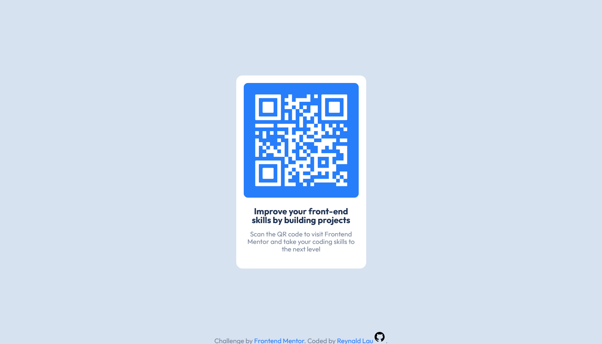

# Frontend Mentor - QR code component solution

Essa é uma solução para o [desafio QR code component do Frontend Mentor](https://www.frontendmentor.io/challenges/qr-code-component-iux_sIO_H).

## Índice

- [Overview](#overview)
  - [Screenshot](#screenshot)
  - [Links](#links)
- [Meu processo](#meu-processo)
  - [Desenvolvido com](#desenvolvido-com)
  - [O que eu aprendi](#o-que-eu-aprendi)
  - [Desenvolvimento contínuo](#desenvolvimento-contínuo)
  - [Recursos úteis](#recursos-úteis)
- [Autor](#autor)

## Overview

### Screenshot

#### Desktop 1440px

#### Mobile 375px

### Links

- Link do site: [https://reynald-durans.github.io/qr-code-component/](https://reynald-durans.github.io/qr-code-component/)

## Meu processo

### Desenvolvido com

- Semantic HTML5 markup
- CSS custom properties
- Flexbox

### O que eu aprendi

Esse mini-projeto me ajudou a melhorar minha escrita de código mais limpo e repetir menos código e também me fez praticar um pouco mais sobre imagens svg.

### Desenvolvimento contínuo

A partir deste projeto quero continuar aprendendo conceitos de responsividade e melhorar meu entendimento sobre grid components, a partir deste ponto meus planos é aprender SASS para estender meu conhecimento em CSS.

### Recursos úteis

- [Como fazer uma div ocupar uma tela inteira](https://pt.stackoverflow.com/questions/197270/como-fazer-uma-div-ocupar-a-p%C3%A1gina-inteira) - Eu estava em dúvida em como ocupar 100% do body pra usar corretamente o display flex sem ficar a barra de rolagem, então o essa resposta neste fórum me ajudou.

## Autor

- Website - Reynald
- Frontend Mentor - [@reynald-durans](https://www.frontendmentor.io/profile/yourusername)
- Twitter - [@reynald-durans](https://www.twitter.com/yourusername)
